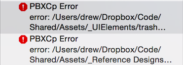
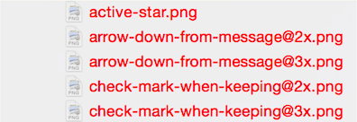
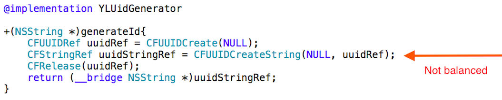

# Clean Code Review #1

This is the first code review for Clean.

## Doesn't compile

The project references assets that are stored outside the git repository.  

This is dangerous for a few reasons:

1.  Changes to assets aren't tracked in source control, and there is no definitive "authority" as to what version is running in production
2. It's a general principle of software development that you should be able to create a build very easily (as Joel Spolsky puts it: ["in one step"](http://www.joelonsoftware.com/articles/fog0000000043.html)).
3. Any new software developer will have to pester the existing developers with questions about how to get started, making the team less, not more, efficient, making it impossible to accelerate the project by adding manpower.

"Breaking the build" is inevitable, and fixing it once is simply fixing it for a week.  A build server can be an effective guardian of the build, or, if too heavy-handed for a 1-man team, a regular process of checking for build breakage should be employed.

## Warnings

This project builds with 9 warnings.  That is not an especially high number, but when warnings accumulate, it becomes a bit of a "boy who cried wolf" situation--you don't notice the 10th warning, that mattered, because it is lost among the 9 that you are used to.

Adopt a zero-tolerance policy for warnings in your own apps.  When you commit, the warning count should be zero.  I find it's helpful to use the `#warning` directive to introduce new warnings, to reminders of things I should do before I commit.  At present that workflow would be difficult.

For 3rd-party code with sloppy developers, compile these into libraries or frameworks so that their warnings don't clutter up your code.  Your compiles will be a lot faster, too.  But the sloppiness of other developers should not be license do be sloppy yourself; if anything, it's license to excise questionable code from your codebase.

## Memory Leak

The YLUIDGenerator class has a memory leak.

## Code organization

There is an Xcode group called "Classes" (a name generic enough to encompass nearly everything in the application).  But perhaps more oddly, it contains several things that are not classes, like extensions.

In general, avoid organizing code based on implementation details.  When a developer comes to the codebase with a problem, their first thought is not going to be "Am I looking for a *class* or an *extension*?"  They are going to be thinking about features, or possibly screens.  They may even be thinking about models (which is organized very well in this codebase).  When you organize a project, approach it from the perspective of how the project will be navigated later, not what the implementation details are today.

## Layout

We live in a world with a lot of device layouts.  The iPhone alone has **4** addressable user interface sizes, and a little bird tells me that iOS as a platform is going to get *much* more size-diverse even than it is today.  *Cough*.

Over the years, Apple has shipped a lot of tools to allow developers to build apps that work well across devices and device families.  Xibs.  Storyboards.  Autolayout.  Size classes.  Adaptive UIKit.  Meanwhile, this codebase sets frames in code like it's 1999.

These tools have steep learning curves.  They are not easy to pick up, and they are very frustrating at times.  Even the most experienced pros have war stories about them.  But they're also the only realistic way to support the iOS family with a reasonable amount of effort, and to be prepared to rapidly adopt new form factors when they appear in the future.  And the longer one goes without picking them up, the more difficult it will be to catch up with other developers who have years of experience with these complex technologies and can intuit the right answers very quickly.

Pick either a simple existing class or a new one going forward to start picking up the quirks of these tools.  Accept that progress will be slower at first.  

## Swift

Objective-C is going away.  Not today, not tomorrow, not this year, but eventually.  It's important that you use the time you've got to prepare for the new regime.

Swift is still very rough around the edges.  The tooling, in particular, has a lot of strange idiosyncrasies.  The interoperability between Swift and ObjC has idiosyncracies as well.  The language, however, does not.  And in that sense it's a large step forward over ObjC in terms of productivity, even as the tool quality and interoperability quality chip away at that advantage.

Pick a new class you plan to write, that doesn't interop with the rest of the world much, and write it in Swift.  Observe how the new language features start to influence architecture decisions.  Things like the APIs you design, the names you give methods, the datastructures you use, and even how you approach a problem all seem to change subtly when you have access to Swift's features.  It's time to get a feel for what that means now.

## Commit messages

Commit messages like "before hotfix branch", "david's fixes", and "tested messages" are typical in this project.  Commit messages have some important functions, and these messages tend to rob them of all utility.

Generally speaking, a commit message is useful to jog your memory about why some particular hunk of code is changed.  Like a code comment, but one that's always present for every line of code.  Messages shouldn't be judged on length, they can in fact be very short. But it's unlikely that you can get a good one with just 2 or 3 words.  

As a project gets larger, some of the decisions you make get re-decided.  Those new decisions may be better, or they may be worse, than your original design.  But unless you have a record of why you made those decisions, you are never really sure if you are smarter now or if you were smarter then.

Here's an example of a commit message I wrote recently:

    Working around a (bug?) in UICollectionView
    It turns out that UICollectionView likes to raise unsatisfiable constraints for some reason in this case.
    Those contraints contain a (surprise) autoresizing mask constraint.
    That resizing mask constraint is now manually removed in code.  But for some reason, doing that causes all trailing
    constraints to be interpreted as negative leading constraints (WTF) so your content appears to the left of the container
    (e.g. invisible).
    I'm converting the layout to be all-leading, even though that's not a very natural flow for this view.  Such are prototypes.  

If you approach my example commit message from the perspective of someone debating about changing the code months or years later, they have a lot of information to work with:

* Why the change was made.  It involves a UICollectionView bug.
* A description of the bug.  An unexpected constraint appears in the view.
* Ideas that were tried.  Someone could, with this information, continue to investigate the bug to find a different solution, without duplicating effort.
* The ultimate solution, reversing the constraints, which is a bit strange, and might all by itself trigger questions that would lead to reading this commit message
* The fact that time pressure played a major role in this decision, suggesting that future self probably could generate a better solution than past self did, with more time to think about it.

If you're regularly making a lot of commits, don't worry about targeting this length, because many short commits in aggregate can tell the same story that this message does in one go.  Another reason to avoid this is if you have some external explanation, like a bug tracker, specification, or code-level documentation, that explains the codebase or the commit in detail.  But if you're committing once a day, or less, and there is no other resource to understand the change, you should be targeting this level of detail.  This is the kind of detail that helps you make sense of things you did long ago.

