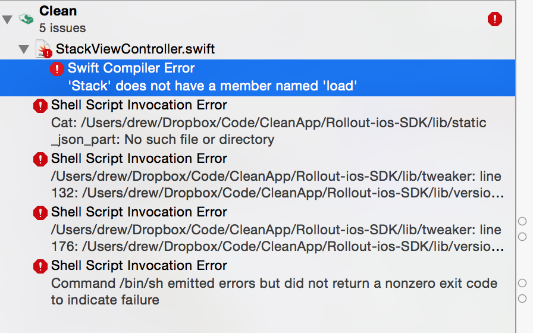

# Clean Code Review #3

## Threading issues

In general, multithreading is one of the hardest problems in computer science.  This is an issue that comes up quite often not just in iOS applications but all over map.  In a previous life I've worked as a research assistant doing new science in this field.

Generally, the way to stay out of trouble is to develop some rules of thumb (often called *invariants*) that provide a quick way to judge whether a given block of code is legal or illegal.  In such a way the threading details of each individual API method are not usually required to be consulted to verify correct threading operation.

In iOS, the invariant in force generally is that a framework (or occasionally a class) will specify

1.  The thread (queue) on which the framework is to be used
2. The thread (queue) on which the callbacks, delegates, blocks, or other "nonlinear return path" will be executed

e.g., for UIKit, the answers to both questions are "the main queue".  So there is no ambiguity when you see a UIAlertView being created, that if it is not being done on the main queue then it is wrong.  And you don't need to consult the documentation to find out on what queue a UIKit notification will be posted, because it's the main queue.  So this invariant makes it easy to audit a project for UIKit threading issues.

In this codebase there are a variety of conventions in force that make it difficult to verify the thread behavior by simple inspection.

### YLCameraRoll

As a case study, consider `YLCameraRoll`.  There are 2 key questions about this class:

1.  What threads (queues) can you call `YLCameraRoll` methods from?
2.  What threads (queues) will the blocks, delegates, and other "nonlinear return path" be executed on?

With regard to question 1, some methods, such as `reload` delegate their operation entirely to PhotosKit, which uses its own thread synchronization mechanism internal to that framework and since nothing exciting is happening inside `YLCameraRoll` these functions are legal to use on any thread, a property it inherits transitively from PhotosKit.

On the other hand, `reloadAssetsWithBlock` performs an operation that is performancewise-unsuitable for use on the main thread.  This creates uncertainty about the answer to this question, which defies simple inspection.

As a follow-up observation about this case, `reloadAssetsWithBlock` in practice runs on a queue internal to PhotosKit.  Holding up this queue unnecessarily may create performance problems.  In fact it appears that the most expensive parts of the operation were moved into a new queue, suggesting that the most naive approach indeed caused performance problems that were observed and 'resolved' by moving the worst offenders around.

With regard to question 2, this class has a delegate, that in practice re-uses a callback queue from PhotosKit.  Again, holding up this queue arbitrarily is probably unwise.  But more importantly, the delegate (which in practice is only a UIViewController) is now tasked with remembering to jump back onto the main queue at the start of each callback.  While that's not a deal-breaker, it creates opportunities for error by omitting a `dispatch_async(dispatch_get_main_queue(), ...)` in a place where that error is *very* unlikely to be noticed.  Because in general a VC is probably working with UIKit threading conventions, and things are on the main queue by default.

What would be much better is if:

1.  The class had clear documentation, at least at the class level, or failing that at the public method level, for the queue or queues on which methods are to be called
2. Since the delegate is thought to be UI code, YLCameraRoll should take responsibility for calling delegate methods on the main queue, narrowing the scope of thread bugs from "all implementatons of this delegate projectwide" to "all calls on the delegate in `YLCameraRoll`.  **or**
3.  It should be clearly documented as a comment in front of each method in the delegate protocol that the callbacks will be called on a special, private queue which should not be held up and the delegate must jump to a more appropriate queue (such as the main queue, if it's desired to do UI work) quickly.

By adopting conventions and writing these conventions in a convenient place (such as class/method comments) it becomes possible to verify threading issues by simple inspection.  

## Main View Refactor

In general, a refactor appears to be in progress involving the main view.  From what I can see at this point, the refactor appears to be sound and shows good organizational principles.

The [commit message](https://github.com/eytanlevit/CleanApp/commit/cccc317b5d2650466b7787f2dfa4519fc669f817) associated with the refactor is good.

The new design appears to be using NSOperationQueue to cache images.  The caching code should be audited to ensure that no race conditions exist in concurrent operations. 

The NSOperationQueues being used should be audited for the correct `qualityOfService` value, which is a new API in iOS 8. I'm prevented from suggesting an appropriate value for this property because of the failing build.

## Followup on previous reviews

### Project doesn't build

The project continues not to build, for more reasons than previously.  In addition to missing assets, which shows no appreciable change, new build errors were introduced.



The project not building continues to have a serious, severe impact to the quality of code reviews.  See the [original warning](https://github.com/eytanlevit/CleanApp/blob/master/Code%20Reviews/1/1.md#doesnt-compile) and the [follow-up warning](https://github.com/eytanlevit/CleanApp/blob/master/Code%20Reviews/2/2.md#doesnt-build).

### Code organization

Excellent progress was made in this area.  The project files seem well-organized now.

### Layouts

More work was done in this area.  I'm a bit puzzled by the duplication between `Main.storyboard` and `Stack.storyboard`, but the build failure prevents me from exploring this curiosity further.

### Swift

More progress was made in this area.  The code at this point shows moderate familiarity with Swift.  There are two specific recommendations I'd make at this point:

* Using the `private` keyword more liberally, making it clear what methods/properties are intended or not intended to be part of a class's public/internal contract.  
* Commenting the tops of public/internal methods more liberally, providing a few sentences that generally state the purpose/functionality of a (especially public/internal) method when that is not immediately clear

By way of example, `StackView.swift` contains a method called `pointInside` that modifies the tappable target in some way.  But the particular way that it modifies the target requires a bit of geometry to work out.  Instead, it could read:

```
//Modifies the tap target by shifting it down 50 points.  The tap target doesn't align with the view's bounds because [reason]
```

### Commit messages

Generally, good progress was made in this area, but more improvement is possible.  By way of example, the commit message associated with the function above explains that it's associated with some design change.  It doesn't explain why the design change caused an unusual tap target for that view.

By way of a second example, code refactors like [this one](https://github.com/eytanlevit/CleanApp/commit/cccc317b5d2650466b7787f2dfa4519fc669f817) are bundled with changes to third-party frameworks like Apptimize.  Ideally, these two things would be separate.

### Bugs

[Two](https://github.com/eytanlevit/CleanApp/blob/master/Code%20Reviews/2/2.md#memory-leak) [bugs](https://github.com/eytanlevit/CleanApp/blob/master/Code%20Reviews/2/2.md#fail-to-call-super) identified in previous reviews still exist.

### App Delegate

No changes to the App Delegate were observed since the extensive notes in the [previous review](https://github.com/eytanlevit/CleanApp/blob/master/Code%20Reviews/2/2.md#app-delegate).

### YLConfig & YLObjectCache

No relevant changes to these classes were made.
