# Code review #5

# Architecture

To have a useful conversation about architecture and complexity, we have to establish some theory, in the abstract.  Architectural issues, by definition, are independent of any particular implementation, and we need to create some implementation-indepependent words to talk about them.

### Components

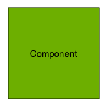

A **component** is a piece of code under analysis.  A component may be a *closure*, a *function*, a *class*, a *framework*, or an entire *program* (or, in a system architecture, a *machine*).

### Links

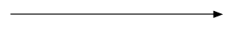

A **link** is a path between one or more *components*, along which *data* may travel.  A link may be a *function call*, an *HTTP request*, a *signal*, a *notification*, etc.  The *direction* of the data is indicated by the arrow, and a link may be *bidirectional* if data flows both ways.

### Circle of concern

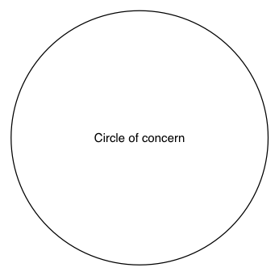

The **circle of concern** is the set of things we have to consider when carrying out a particular development task.  For example, when implementing an about screen, files like `About.swift` and `About.storyboard` would be within our circle of concern, whereas network logic would probably not.

### Complexity

**Complexity** is how difficult it is to do a development task; e.g., how well the architecture adapts to our needs.  

Consider the monolithic program:

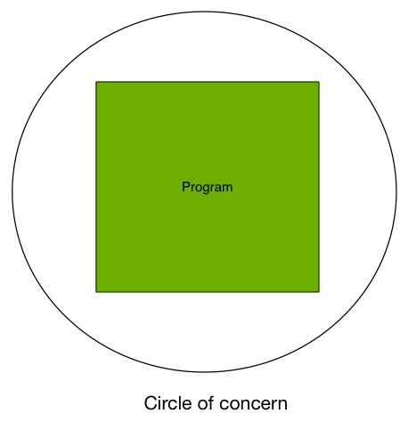

To do any task with a monolithic program we must consider the whole program.  That is extremely complex.  The lesson here is that **complex software can be represented by a simple diagram**.  Do not let the complexity of the diagram fool you.

We might refactor our program into a **fully-connected program**.

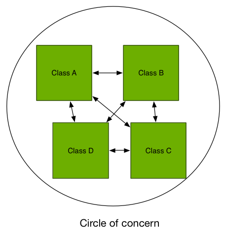

Refactoring in this way *feels* like progress, but usually it isn't.  It may be better-organized, but with every component still connected to every other component, the entire thing must remain within the circle of interest and fit in the developer's head while working.  In fact it may be worse than the monolithic program, if the links are expensive to maintain.  **More classes isn't always better.**

### Loops

One particular pitfall is the **loop**.  Here is an example of a simple loop in Clean:

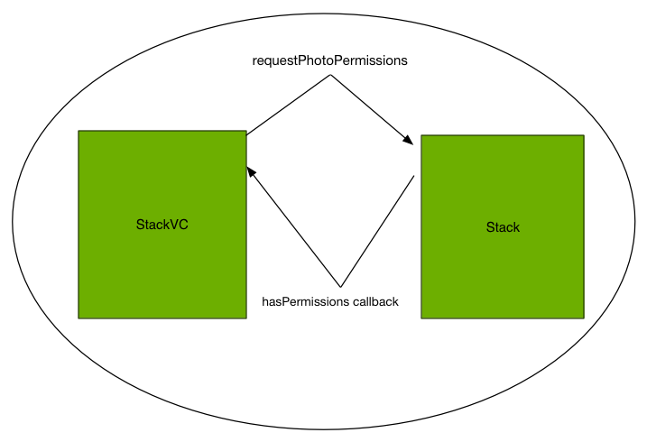

In this loop, we go from `StackVC` to `Stack` over the `requestPhotoPermissions` link, and then at some later point data flows back over the `hasPermissions` callback.  There is nothing inherently wrong with this, but it has some risks.

One risk is that StackVC could, in theory, issue another `requestPhotoPermissions` call in response to the callback.  (What could be wrong with that?  The class does it elsewhere and it's fine.)  Well, because in that case it will cause an infinite loop, although it's a nonblocking loop that may not be immediately noticed.

By the way, this is an example of a *nonintuitive invariant*.  (Invariants were introduced in [code review #3](https://github.com/eytanlevit/CleanApp/blob/master/Code%20Reviews/3/3.md#threading-issues)).  The `requestPhotoPermissions` function is always legal to run, except in the exact case that it is triggered by its own callback (perhaps by some bizarre Rube Goldberg mechanism), and this is an invariant that is very hard to verify by inspection.

What's more, the complete codepath here is tricky.  I've diagrammed the consequences of the single call for clarity, and I'm betting it's significantly more complicated than anybody expected:

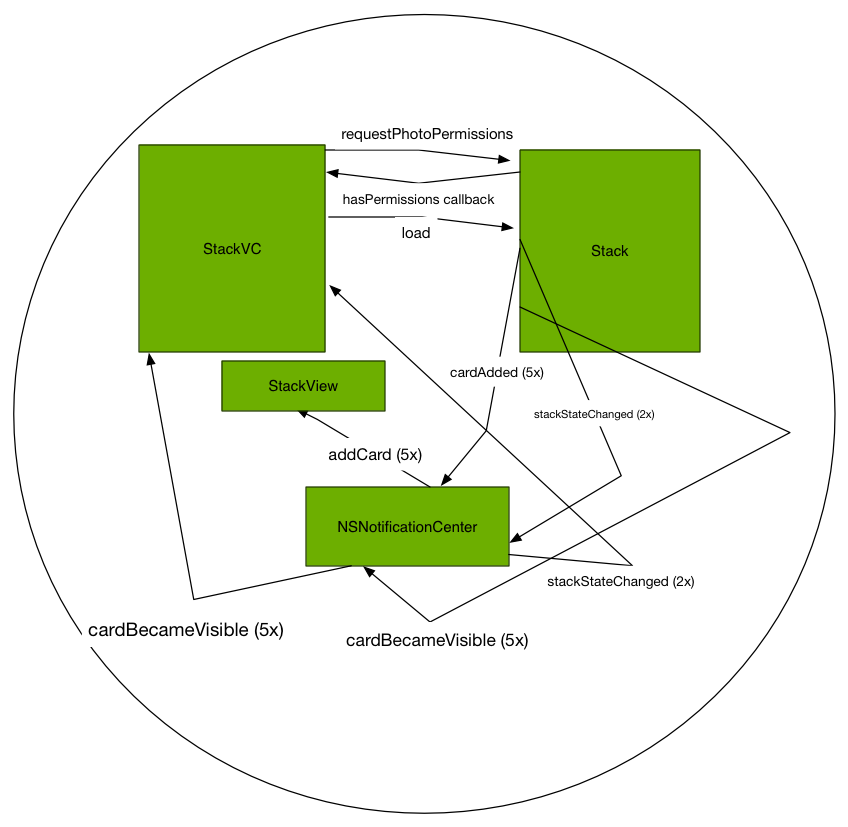

(By the way, this chart is brought to you by: being able to compile the program.  Congrats!)

Pop quiz: do any of these effects of that single `requestPhotoPermissions` call end up causing a loop and the whole thing to happen over again?  The answer is no, but I doubt you could determine that within half an hour.  There are 4 components and 9 links that need to be consulted to answer that question, and I contend that holding 13 things in your memory is a recipe for error.

Now there's not necessarily anything simple that can be done to fix this; the problem is complicated, so the code's going to be complicated too. One thing that can certainly be done is to get better visibility into this problem.  At the very least, if calling 1 method is going to trigger this kind of domino effect there should be some kind of discussion of it in the method documentation.

For example, here is a real comment for a method that does something I find merely *mildly* surprising:

```
 Adjusts the class owner to the given TokenClass GUID in the underlying TableMetadata database.
Note that this irreparably breaks klass._caffeine_ClassOwner, which is no longer true.
```

I would certainly have a much longer comment to explain the consequences of something as elaborate as this.

### Flow order

We can redraw the diagram as follows.  If we ignore the specific names of the links, we get something a bit more legible, although just as complex:

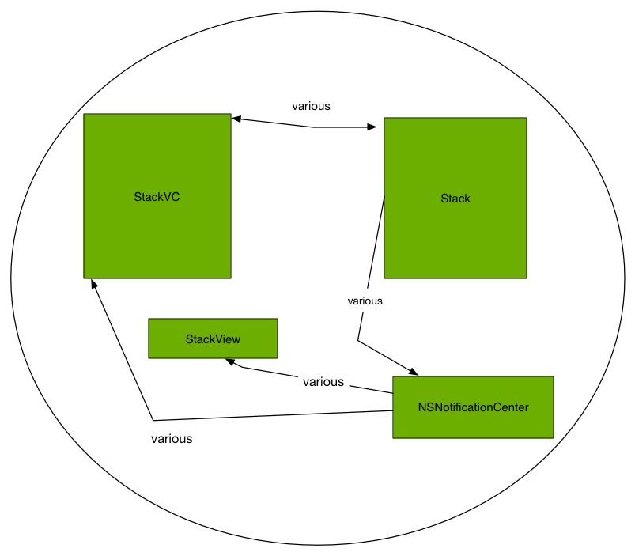

In this representation, a different problem emerges.  **How does the data flow?**

Ideally, the flow would be obvious from this diagram.  Perhaps the `StackVC` initializes the `Stack` model, which then passes data through the `StackView`, perhaps using `NSNotificationCenter` as an intermediary (or perhaps not).  

Instead, in this diagram, we see a *topological* problem: it isn't clear whether `StackVC` gets its data from `Stack` or vice versa.  It also leaves open the possibility that they get data from each other, which is a recipe for disaster.  It makes it hard to exactly match state from one execution to the next (for example, to reproduce a bug somebody's reporting).

There are two solutions to this problem:

* Either move responsibilities around until you have a clear topological ordering between `StackVC` and `Stack`, where one very definitely gets data from the other
* Or if that seems hard, then these are probably the same class, and should be combined.  Recall that breaking up a monolithic program into classes can be of *negative* value if maintaining the links are expensive.  

### Hubs and spokes

Naive application of `NSNotificationCenter` lends itself to a *hub-and-spoke* pattern.

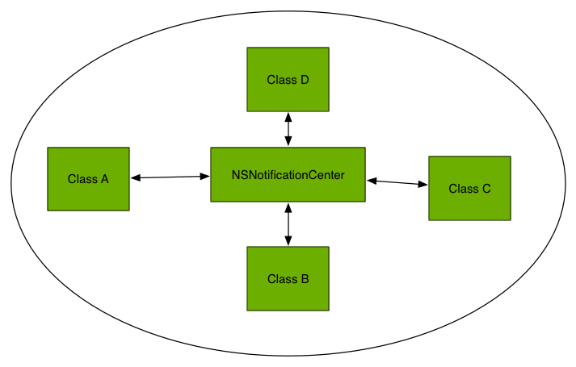

You'll notice that this diagram has the same *topological* problem as the previous diagram; it isn't clear where the data comes from and goes.  While this can be resolved by carefully ensuring that certain classes only post and certain classes only observe (e.g. making the arrows one-way),  doing this in practice requires more discipline than most developers have, because it's just very easy to type `NSNotificationCenter.defaultCenter.postNotificationName`...

In fact, of the 6 classes in this codebase that *post* notifications, fully half of them also *receive* notifications, raising complex questions about where their state actually comes from.

Delegates (and delegate arrays) can help mitigate this problem, but they are not really the answer.  The *answer* is to think carefully about the topological ordering of classes, and the attractive thing about delegates is they take enough time to use that you are more likely to consider the topological implications of adding each one.


### Waterfall topologies

Contrast this with the topologies of other software.  For example, here is a diagram of a project I work on.  The notitation is a little more complicated than the one I've introduced for this review, but you get the idea:

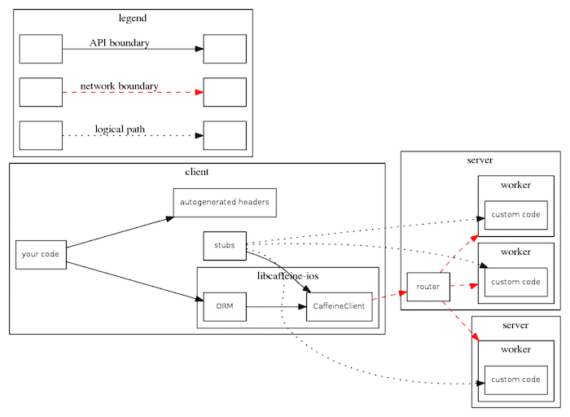

In this diagram there is no debate about how control and data flows; things on the left send information to things on the right.  Now, this diagram is a little misleading because each of these squares are themselves complex components that have a few loops inside them, but not many, and the macro-level interfaces are very carefully constrained to these.

Another interesting thing about this diagram is that the topology is strict at many different levels of abstraction and circles of concern.  For example, if you ignore the dotted lines (which are very ignorable in this notation) it turns out that there is only **one** link between **anything** in the `client` box and **anything** in the `server` box.  So not only is the overall dataflow clear, but for most questions you would have about this codebase you can keep **at least half the chart outside your circle of concern**.  That's a design pattern that means you have to hold much fewer elements in your head at once to work on this codebase.

To summon another example, this was the graphics architecture in iOS 3:

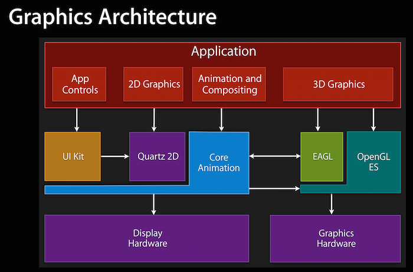

Notice how even though this is a **large, complex, highly-performance critical software**, the topological ordering is largely clear from this diagram.  (With the notable exception of EAGL, which in iOS 8 they replaced.  *Cough*.)

### Recommendations

All of that to say, I'd recommend a few things:

1.  Put your classes into a topological ordering.  Who is the authority on what the truth is?  (Probably a model like `Stack`.)  Who is a regional authority?  Who is a peasant?
2. Consider grouping classes into higher-order groups if that makes sense.  For example, your models probably outrank your views.  Models that work on uncached data probably outrank models that work on cached data.
3. Draw a diagram showing the topology.  Pencil/paper is fine, OmniGraffle is also a good choice.
4. Check it into source control
5. Keep it up to date
6. Consult it whenever you make new links to ensure they're consistent with the topology
7. When you find data flowing "uphill", stop and consider.  Is there some other way to lay it out?  Is there some way to minimize the damage?

Views are a special case of #7, because they both send events into the model, and display events that come out, which can create a loop if the "out from the model" data/events ever make their way into the "input to the model" data/events.  I call this the "view separation problem", in that ideally we'd like to separate the model's *inputs* and its *outputs* but practically, a view often functions as both.

One thing to consider is segregrating those two roles, for example, by moving one of the roles into an `extension` of the view.  

Judicious use of the `private` keyword combined with `extensions` can create a strong wall of separation between different roles within the same view, because `private` is only visible within a *file*, not an entire `class`, so one set of variables/methods can be invisible to the other set within the same class.

Other strategies worth considering on the view separation problem include `//MARK: `.  Code that logically belongs to one role can be placed in a section distinct from the other role.  Although this isn't enforced by the compiler, so it requires a bit more a self-disciplined approach.
